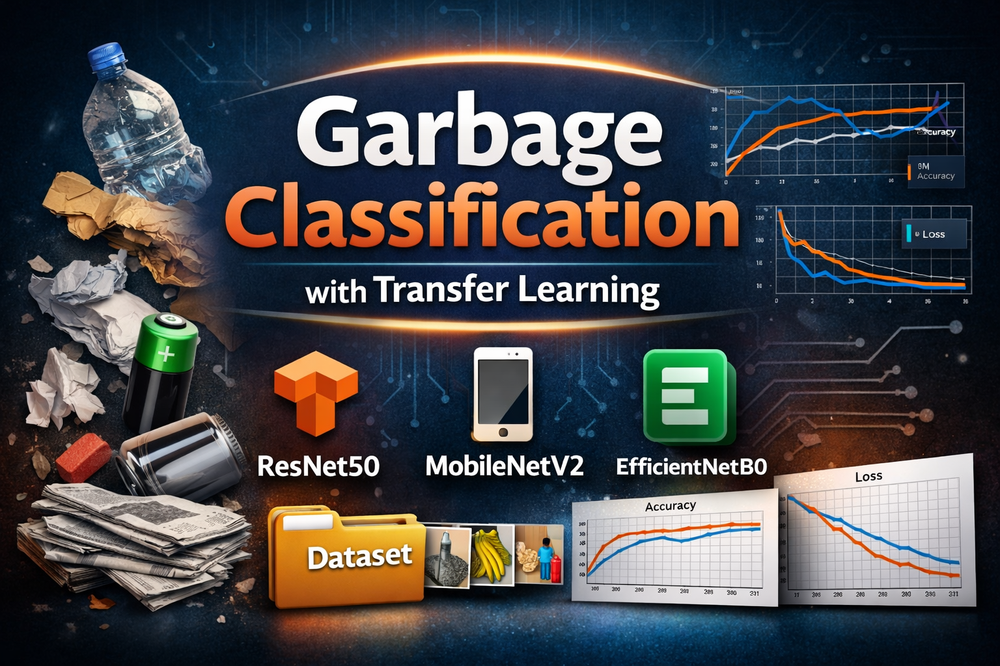

<p align="center">
  
</p>

# Garbage Classification with Transfer Learning


---

## Table of Contents
1. [Overview](#overview)
2. [Motivation](#motivation)
3. [Dataset](#dataset)
4. [Environment & Dependencies](#environment--dependencies)
5. [Setup & Installation](#setup--installation)
6. [Model Architectures](#model-architectures)
7. [Comparative Analysis](#comparative-analysis)
8. [Experimental Configuration](#experimental-configuration)
9. [Usage](#usage)
10. [Visual Evaluation](#visual-evaluation)
11. [Results Summary](#results-summary)
12. [Qualitative Insights](#qualitative-insights)
13. [Key Takeaways](#key-takeaways)
14. [Future Directions](#future-directions)
15. [Project Structure](#project-structure)
16. [Reproducibility and Transparency](#reproducibility-and-transparency)
17. [License](#license)
18. [Author](#author)

---

## Overview

This project presents a comprehensive evaluation of deep learning models for image-based garbage classification. It compares a baseline convolutional neural network (CNN) trained from scratch with several state-of-the-art transfer learning architectures, all evaluated under consistent experimental conditions.

All experiments, visualizations, and analyses are contained within a single notebook to ensure transparency, reproducibility, and clarity.

---

## Motivation

Automatic garbage classification plays a vital role in **modern waste management and sustainability initiatives**. Manual sorting of waste is labor‑intensive, inconsistent, and difficult to scale, especially in recycling facilities and smart city infrastructure. By leveraging deep learning and transfer learning techniques, this project aims to **automate the identification of common garbage types from images**, enabling more efficient recycling processes, reduced operational cost, and improved environmental outcomes.

This project benchmarks a **baseline CNN** against state-of-the-art **pretrained architectures** including **ResNet50, MobileNetV2, and EfficientNetB0** to provide insights into the **accuracy–efficiency trade-offs** critical for both research and real-world deployment of image-based waste sorting systems.  

*Repository:* [GitHub – Garbage Classification Transfer Learning](https://github.com/ArianJr/garbage-classification-transfer-learning)

---

## Dataset

This project uses the **Garbage Classification V2 dataset** from Kaggle, designed for machine learning research in waste classification. The dataset contains photographic images of everyday waste items labeled across **10 categories**:

- Metal  
- Glass  
- Biological  
- Paper  
- Battery  
- Trash  
- Cardboard  
- Shoes  
- Clothes  
- Plastic  

Original dataset: [Kaggle – Garbage Classification V2](https://www.kaggle.com/datasets/sumn2u/garbage-classification-v2)

To support experimentation with limited data, this repository uses a **reduced experimental subset**:

| Split         | Images | Notes                          |
|---------------|--------|--------------------------------|
| Training      | 100    | 10 images per class            |
| Validation    | 20     | 2 images per class             |
| Test          | 10     | 1 image per class              |

This intentionally small subset highlights **transfer learning’s ability to generalize from minimal labeled data**, reflecting practical scenarios where large, balanced datasets are unavailable.  

> Each split is included in the repository, allowing users to **reproduce experiments** and evaluate model performance consistently.

---

## Environment & Dependencies
* Python 3.10+  
* TensorFlow 2.x  
* NumPy, Pandas, Matplotlib, Seaborn  
* scikit-learn  
* Jupyter Notebook / JupyterLab  

> Installing via `pip install -r requirements.txt` recommended for reproducibility.

---

## Setup & Installation

1. Clone the repository:
```bash
git clone https://github.com/ArianJr/garbage-classification-transfer-learning.git
cd garbage-classification-transfer-learning
```
2. Install dependencies:
```bash
pip install -r requirements.txt
```
3. Launch the notebook:
```bash
jupyter notebook transfer_learning_garbage_classification.ipynb
```

---

## Model Architectures

### CNN from Scratch
Baseline convolutional neural network trained without pretrained weights. This model establishes a lower-bound reference for performance and learning behavior.

### ResNet50 (Transfer Learning)
Deep residual network pretrained on ImageNet, used as a feature extractor to leverage rich hierarchical representations.

### MobileNetV2 (Transfer Learning)
Lightweight architecture optimized for efficiency while maintaining strong predictive performance. Suitable for deployment-oriented scenarios.

### EfficientNetB0 (Transfer Learning)
Modern architecture using compound scaling to balance depth, width, and resolution, achieving high accuracy with fewer parameters.

### Comparative Analysis
All models are evaluated side by side to highlight architectural trade-offs and performance trends.

---

## Experimental Configuration

| Component           | Description                                    |
| ------------------- | ---------------------------------------------- |
| Input Resolution    | Uniform resizing across all models             |
| Loss Function       | Categorical Crossentropy                |
| Optimizer           | Adam                                           |
| Evaluation Metric   | Accuracy                                       |
| Data Augmentation   | Random flips, rotations, zooms (training only) |
| Validation Strategy | Held-out validation dataset                    |

This controlled setup ensures a fair and meaningful comparison across architectures.

---

## Usage

- Run the notebook to reproduce training and evaluation.  
- Visualizations include:
  - Training/validation loss and accuracy curves  
  - Confusion matrices for each model  
  - Comparative performance charts  

---

## Visual Evaluation

### Training and Validation Curves

The notebook includes **five complete sets of loss and accuracy curves**:

* CNN from Scratch
* ResNet50
* MobileNetV2
* EfficientNetB0
* Combined cross-model comparison

These visualizations provide insight into:

* Convergence speed
* Generalization behavior
* Overfitting tendencies

Maintaining all curves supports transparent and evidence-based model selection.


### Confusion Matrix Heatmaps

For each model, a **confusion matrix heatmap** is generated.

These visual diagnostics enable:

* Per-class performance assessment
* Identification of systematic misclassifications
* Comparison of class separability across models

This level of analysis is essential for understanding real-world model behavior beyond aggregate accuracy.

---

### Cross‑Model Comparison
The overall comparison plot highlights differences in convergence and accuracy across all models:


---

### Model‑Specific Diagnostics

<details>
<summary>CNN from Scratch</summary>

**Loss & Accuracy Curves**


**Confusion Matrix**


</details>

<details>
<summary>ResNet50</summary>

**Loss & Accuracy Curves**


**Confusion Matrix**


</details>

<details>
<summary>MobileNetV2</summary>

**Loss & Accuracy Curves**


**Confusion Matrix**


</details>

<details>
<summary>EfficientNetB0</summary>

**Loss & Accuracy Curves**


**Confusion Matrix**


</details>

All plots are embedded below for direct inspection. Original high-resolution files are also stored in the [`results/`](results/) directory.

---

## Results Summary

### Quantitative Performance Overview

| Model            | Accuracy | Relative Performance | Key Observations                            |
|------------------|----------|--------------------|-----------------------------------------------|
| CNN from Scratch | 43.3%    | Lowest             | Limited generalization, slower convergence    |
| ResNet50         | 91.2%    | Very High          | Stable training, strong feature extraction    |
| MobileNetV2      | 90.2%    | High               | Optimal balance of accuracy and efficiency    |
| EfficientNetB0   | 92.2%    | Very High          | Consistent accuracy with compact architecture |

> Exact numerical metrics are reported in the notebook to preserve experimental integrity.
> Transfer learning models outperform the baseline CNN, showing that pretrained features are highly effective for garbage classification. 

### Qualitative Insights

* Transfer learning consistently outperforms training from scratch
* Efficient architectures generalize well on visually similar classes
* Confusion matrices confirm improved class-level discrimination

---

## Key Takeaways

* Transfer learning substantially enhances classification performance
* Model efficiency does not necessarily compromise accuracy
* Visual evaluation is critical for reliable model assessment

---

## Future Directions

* Fine-tuning deeper layers of pretrained networks
* Addressing class imbalance
* Hyperparameter optimization
* Evaluation using newer architectures (EfficientNetV2, ConvNeXt)

---

## Project Structure

## Project Structure

| Path / File | Description |
|------------|-------------|
| `dataset/` | Image dataset directory containing garbage classification images |
| `models/` | Saved model architectures and trained model weights |
| `results/` | Generated plots, figures, and evaluation outputs |
| `.gitignore` | Specifies files and directories to be ignored by Git |
| `LICENSE` | MIT License |
| `README.md` | Project overview, documentation, and analysis summary |
| `requirements.txt` | Python dependencies required to run the project |
| `transfer_learning_garbage_classification.ipynb` | Complete implementation: training, evaluation, and visualization |

---

## Reproducibility and Transparency

* All metrics and figures are generated directly within the notebook
* Experiments progress sequentially from baseline to advanced models
* Visual evidence is preserved to support all conclusions

---

## License

This project is licensed under the **MIT License** – see the [LICENSE](LICENSE) file for details.  

---

**Author:** *Arian Jr*  
**Focus Areas:** Computer Vision · Deep Learning · Transfer Learning  
